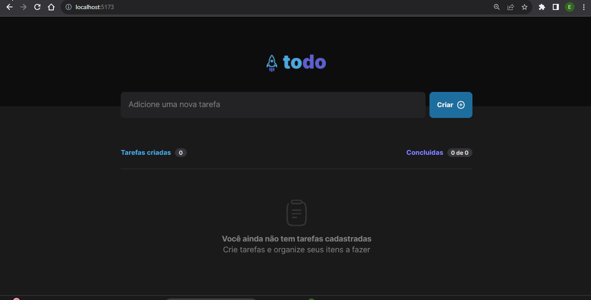

# ToDo list

Este é uma aplicação todo list, para organaniar tarefas de forma simples.
 
## Sobre o Projeto

O projeto é uma aplicação no estilo lista de tarefas (to-do list), desenvolvida para web e responsiva em todos os dispositivos. Foi criado utilizando React + TypeScript, empregando métodos de imutabilidade e estados do React para dar vida a uma aplicação limpa e com estilo.

## Desenvolvedor(Github)

- [Eduardo Ananias](https://github.com/Du-devBR)

## Funcionalidades

- Adicionar uma nova tarefa
- Marcar e desmarcar uma tarefa como concluída
- Remover uma tarefa da listagem
- Mostrar o progresso de conclusão das tarefas

## Como Executar o Projeto

### Pré-requisitos

- Gerenciador de pacotes, exemplo: npm, yarn

### Passos

1. Clone este repositório em sua máquina local.

   ```bash
   git clone https://github.com/Du-devBR/rocketDesafio-todo.git
2. Navegue até o diretório do projeto.
    ```bash
    cd .\Desafio-todo\
3. Instale as dependências do projeto.
    ```bash
    npm install ou yarn install
4. Inicie o servidor de desenvolvimento.
    ```bash
    npm run dev
    yarn init
5. Abra seu navegador e acesse:
    ```bash
    http://localhost:5173

### Contribuição
Se você deseja contribuir com o projeto, sinta-se à vontade para abrir um pull request. Será um prazer receber suas contribuições!
